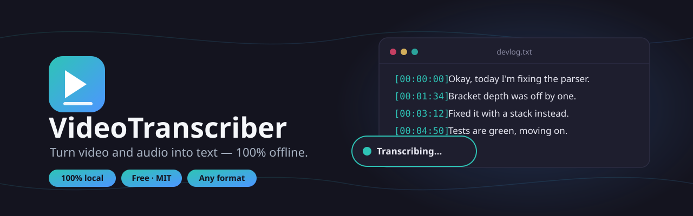
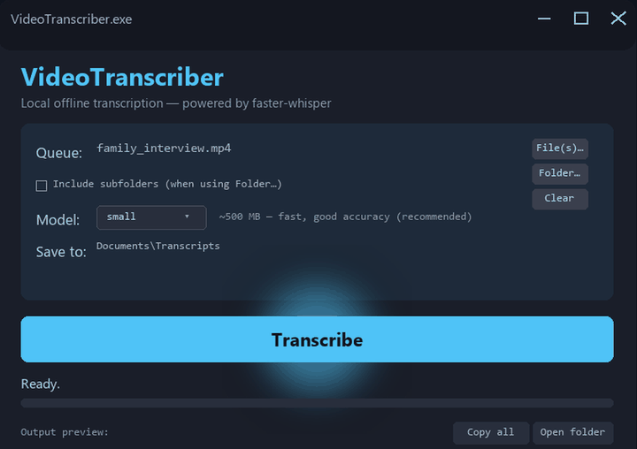
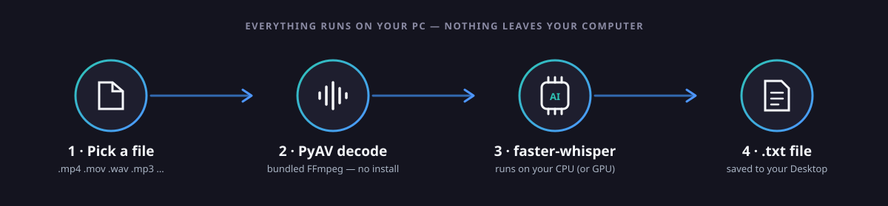
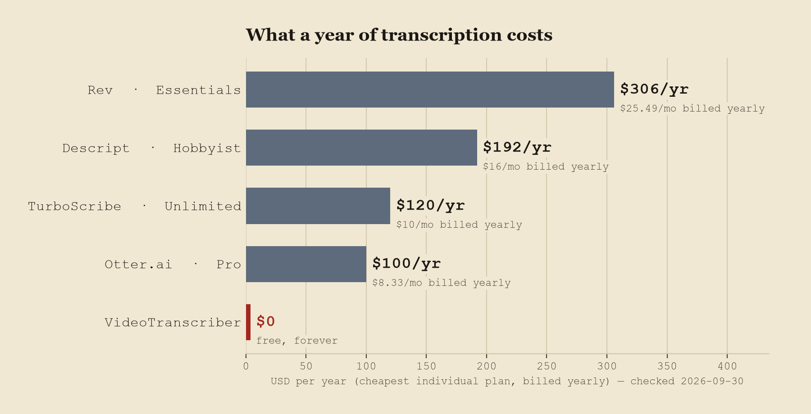

<p align="center">
  
</p>

<p align="center">
  <a href="https://github.com/awesomo913/VideoTranscriber/releases/latest"></a>
  <a href="https://github.com/awesomo913/VideoTranscriber/releases"></a>
  <a href="LICENSE"></a>
  
  <a href="https://github.com/awesomo913/VideoTranscriber/actions/workflows/ci.yml"></a>
  
</p>

<p align="center"><b>Drop in a video or audio file, get back a plain text transcript — no cloud upload, no account, no API key, no subscription.</b></p>

<p align="center">
  <a href="https://github.com/awesomo913/VideoTranscriber/releases/latest"><b>⬇ Download for Windows</b></a>
</p>

<p align="center">
  
</p>

## Why VideoTranscriber

- **Actually local.** Transcription runs on your own CPU (or GPU, if available) via [faster-whisper](https://github.com/SYSTRAN/faster-whisper). Your recordings never leave your machine.
- **No install headaches.** Media decoding goes through [PyAV](https://github.com/PyAV-Org/PyAV), which ships its own bundled FFmpeg libraries — you don't need to separately install `ffmpeg` on your system.
- **Handles video directly.** Point it at an `.mp4` and it transcribes the audio track — no manual extraction step.
- **Built for dev logs and long recordings.** Timestamped output (`[HH:MM:SS] ...`) makes it easy to jump around a 20–30 minute recording, or drop the whole thing into an LLM prompt.
- **GUI and CLI, one file or a whole folder.** Point-and-click for one-off use, or script it for batch jobs.
- **Free and open source.** MIT licensed. No paywall, no upsell, no telemetry.

## Quick start

1. **[Download the latest release](https://github.com/awesomo913/VideoTranscriber/releases/latest)** and run `VideoTranscriber.exe` (Windows), or [build from source](#build-from-source) on macOS/Linux.
2. First run downloads the speech model (small, ~480 MB) — after that it works fully offline.
3. Pick a file (or a folder), choose a model, click **Transcribe** — a `.txt` file appears on your Desktop.

## How it works

<p align="center">
  
</p>

1. You pick one or more media files (or a whole folder).
2. PyAV opens the file and hands the audio to faster-whisper — no external ffmpeg install needed.
3. faster-whisper (a fast reimplementation of OpenAI's Whisper) transcribes the audio, entirely on your machine.
4. The transcript is written to a `.txt` file — one per source file, and/or one merged file for a whole batch.

## Features

| Feature | Detail |
|---------|--------|
| **Fully offline** | Runs on your machine — nothing leaves your device |
| **Video + audio** | `.mp4 .mov .mkv .avi .mp3 .wav .m4a .webm .ogg .flac .aac .mpeg` handled directly |
| **Timestamps** | `[00:01:42] segment text` format, toggleable |
| **Auto CPU fallback** | Detects GPU; silently falls back to CPU if CUDA libraries are missing |
| **Model choice** | tiny / base / **small** (default) / medium / large-v3 |
| **GUI + CLI** | Desktop window or command line |
| **Batch / folder** | CLI: multiple paths, `--dir`, `--recursive`, `--combined` / `--combined-only`. GUI: File(s)…, Folder… |
| **Windows .exe** | Single-file executable via `build.py` |

## Choosing a model

Bigger models are more accurate and slower. All run on CPU — no GPU required (though one is used automatically if present).

| Model | Approx. download | Speed (30 min audio, CPU) | Best for |
|-------|------|----------------------|----------|
| tiny | ~75 MB | ~1 min | Quick drafts |
| base | ~145 MB | ~2 min | General use |
| **small** (default) | **~480 MB** | **~3–4 min** | **Dev logs, general use** |
| medium | ~1.5 GB | ~8 min | Higher accuracy |
| large-v3 | ~3 GB | ~15 min | Best quality |

## Usage

```bash
# GUI
python transcribe_gui.py

# CLI — one file
python transcribe_video.py devlog.mp4
python transcribe_video.py devlog.mp4 --model base --no-timestamps
python transcribe_video.py devlog.mp4 --out-dir D:\exports   # optional; default is Desktop

# CLI — many files (one model load; exits 1 if any file fails)
python transcribe_video.py a.mp4 b.wav meeting.m4a
python transcribe_video.py --dir ./recordings
python transcribe_video.py --dir ./recordings --recursive

# One merged .txt on Desktop (no per-file transcripts)
python transcribe_video.py --dir ./videos --combined-only
# Merged file + individual .txt files
python transcribe_video.py --dir ./recordings --combined
# Custom merged path
python transcribe_video.py --dir ./vids --combined-only --combined-out D:/all_transcripts.txt
```

See [TUTORIAL.md](TUTORIAL.md) for full platform-specific setup (Windows / macOS / Linux / Raspberry Pi / Android).

## Comparison

<p align="center">
  
</p>

Prices below are the **cheapest individual/consumer plan** that includes AI transcription for each product, looked up directly on the vendor's official pricing page. Checked **2026-09-30**.

| Product | Plan | Monthly price | Billed annually (per mo) | Source |
|---|---|---|---|---|
| **VideoTranscriber** | — | $0 | $0 | (this project) |
| Otter.ai | Pro | $16.99/mo | $8.33/mo (~$100/yr) | [otter.ai/pricing](https://otter.ai/pricing) |
| TurboScribe | Unlimited | $20/mo | $10/mo ($120/yr) | [turboscribe.ai/pricing](https://turboscribe.ai/pricing)¹ |
| Descript | Hobbyist | $24/mo | $16/mo ($192/yr) | [descript.com/pricing](https://www.descript.com/pricing) |
| Rev | Essentials | $29.99/mo | $25.49/mo ($305.90/yr) | [rev.com/pricing](https://www.rev.com/pricing) |

¹ TurboScribe's pricing page blocked automated fetching directly (HTTP 403); the numbers above were cross-checked across several independent third-party pricing trackers that agreed on the same figures, but they were not read from the raw page itself the way the other three were — verify on [turboscribe.ai/pricing](https://turboscribe.ai/pricing) before quoting this elsewhere.

| | VideoTranscriber | Windows Voice Typing (Win+H) | Cloud transcription subscriptions |
|---|---|---|---|
| Cost | Free | Free | Paid / subscription |
| Works offline (after setup) | Yes | Varies | No |
| Audio/video leaves your PC | No | Varies | Usually yes |
| Batch / folder processing | Yes | No | Varies |
| Open source | Yes | No | No |

## Limitations

Being upfront about what this is and isn't:

- **Speed depends on your CPU.** Without a supported GPU, a 30-minute recording takes roughly 3–4 minutes with the default `small` model — larger models are considerably slower (see the table above).
- **First run downloads the model.** ~480 MB for the default `small` model, more for larger ones. This requires internet once; after that it's fully offline.
- **Accuracy drops on noisy or quiet audio.** Whisper-based models do best with clear speech; ambient noise, heavy background music, or very quiet recordings produce sparser or less accurate transcripts.
- **No speaker labels.** Output is plain transcribed text with optional timestamps — it does not identify or separate different speakers.
- **GUI needs a desktop environment.** The GUI (CustomTkinter/Tkinter) doesn't run headless; use the CLI on servers or Raspberry Pi.
- **The release `.exe` is unsigned.** See the FAQ below.

## FAQ

<details>
<summary>Windows says "Windows protected your PC" — is this safe?</summary>

VideoTranscriber's release `.exe` isn't code-signed (signing certificates cost money for an independent open-source project), so Windows SmartScreen flags unknown publishers by default. Click **More info → Run anyway**, or verify the download against `SHA256SUMS.txt` on the [release page](https://github.com/awesomo913/VideoTranscriber/releases/latest), or build from source yourself (see below).
</details>

<details>
<summary>My antivirus flagged the .exe — is it malware?</summary>

PyInstaller-built executables are frequently false-positived by antivirus engines because the same packing technique is also used by actual malware to bundle a Python interpreter. This is a known, common issue for PyInstaller apps in general. If you'd rather not trust the prebuilt binary, build from source — it's a few commands (below) and you can read every line first.
</details>

<details>
<summary>Do I need to install ffmpeg?</summary>

No. Earlier versions of this project required a system `ffmpeg`/`ffprobe` install on `PATH`. That requirement has been removed — faster-whisper decodes media through PyAV, which bundles its own FFmpeg libraries, so `uv pip install -r requirements.txt` (or the prebuilt `.exe`) is all you need.
</details>

<details>
<summary>Does this send my recordings to the internet?</summary>

No. After the Whisper model downloads once, everything runs locally on your machine. See [SECURITY.md](SECURITY.md) for the full scope notes.
</details>

<details>
<summary>Does it use my GPU?</summary>

If a supported CUDA GPU and its libraries are present, faster-whisper uses it automatically; otherwise it silently falls back to CPU. No manual configuration needed either way.
</details>

<details>
<summary>Does VideoTranscriber work on Mac or Linux?</summary>

Yes for the CLI and (with a desktop environment) the GUI — see [TUTORIAL.md](TUTORIAL.md) for platform-specific setup, including Raspberry Pi and Android (Termux, CLI only). The prebuilt `.exe` is Windows-only; other platforms run from source.
</details>

<details>
<summary>Can I use this from my own Python script?</summary>

Yes:
```python
from transcribe_video import transcribe
from pathlib import Path
out = transcribe(Path("devlog.mp4"), model_name="small", timestamps=True)
print(f"Written to {out}")
```
</details>

<details>
<summary>Something failed — where's the log?</summary>

VideoTranscriber writes a plain-text log to `%LOCALAPPDATA%\VideoTranscriber\logs\app.log` on Windows (`~/.local/state/VideoTranscriber/logs/app.log` elsewhere). If you open an issue, attaching the last few lines helps a lot — they contain file names and timings, never your transcript text.
</details>

## Build from source

Requires Python 3.11.

```bash
git clone https://github.com/awesomo913/VideoTranscriber.git
cd VideoTranscriber
uv venv --python 3.11
uv pip install -r requirements.txt
python transcribe_gui.py
# or: python transcribe_video.py devlog.mp4
```

Build the standalone Windows exe:

```bash
uv pip install -r requirements-dev.txt
python build.py
# → dist/VideoTranscriber.exe
```

Model weights are **not** bundled into the exe — they download on first run (~480 MB for the default `small` model).

Run tests and lint:

```bash
pytest
ruff check .
```

## Contributing

Contributions are welcome — see [CONTRIBUTING.md](CONTRIBUTING.md) for dev setup, architecture notes, code style, and good-first-issue ideas. Please also see our [Code of Conduct](CODE_OF_CONDUCT.md).

If VideoTranscriber saves you time, a ⭐ helps others find it.

## License

[MIT](LICENSE) © 2026 awesomo913

## Publisher

Published by **Revolutionary Designs**.  
GitHub: https://github.com/awesomo913  
Contact: contact@revolutionarydesigns.io  <!-- pii-ok: official brand contact -->

